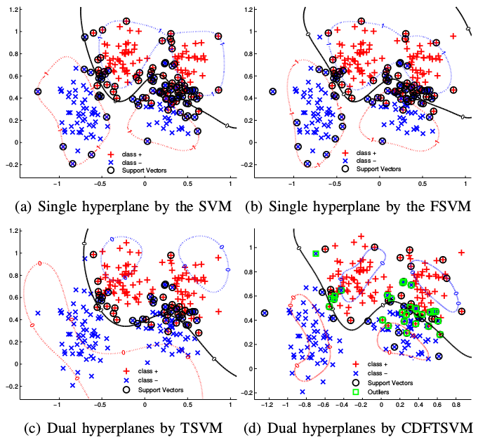

This package is a MATLAB implementation of ["Coordinate Descent Fuzzy Twin Support Vector Machine for Classification",Bin-Bin Gao, Jian-Jun Wang, Yao Wang and Chan-Yun Yang](http://lamda.nju.edu.cn/gaobb/Pub_files/icmla15_FTWSVM.pdf). You can train cdftsvm model on your own dataset for binary classification problems. This package is created by [Bin-Bin Gao](http://lamda.nju.edu.cn/gaobb/).

The CDFTSVM not only inherits the advantages of twin SVM but also leads to a fast and robust classification results. It is suitable for high dimension and noisy inputs.


# Usage Instructions:

In matlab, run demo.m.

# Visualization:
<div align=center></div>
# Additional Information

If you find CDFTSVM helpful, please cite it as
```
@inproceedings{gao2015coordinate,
  title={Coordinate Descent Fuzzy Twin Support Vector Machine for Classification},
  author={Gao, Bin-Bin and Wang, Jian-Jun and Wang, Yao and Yang, Chan-Yun},
  booktitle={2015 IEEE 14th International Conference on Machine Learning and Applications (ICMLA)},
  pages={7--12},
  year={2015},
  organization={IEEE}
}
```
For any questions and comments, please send your email to csgaobb@gmail.com.

